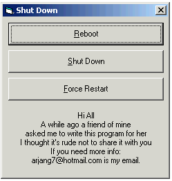

<div align="center">

## Absolute Windows Shut Down


</div>

### Description

When you use the ExitWindowsEx API to reboot the system under Windows NT and Windows 2000, the machine does not reboot.

'CAUSE

In order to programmatically reboot a Windows NT or Windows 2000 system, the process requires the SE_SHUTDOWN_NAME privilege. By default, Visual Basic applications do not have this privilege and therefore will not reboot the machine.

In order to get ExitWindowsEx API to reboot the system under Windows NT or Windows 2000, the SE_SHUTDOWN_NAME privilege must be set.

This Code Shows you the best way to reboot force restart or shut down a PC
 
### More Info
 
Be carefull It will restart the machine.


<span>             |<span>
---                |---
**Submitted On**   |1998-09-01 04:34:42
**By**             |[Arjang](https://github.com/Planet-Source-Code/PSCIndex/blob/master/ByAuthor/arjang.md)
**Level**          |Advanced
**User Rating**    |4.7 (70 globes from 15 users)
**Compatibility**  |VB 6\.0
**Category**       |[Windows API Call/ Explanation](https://github.com/Planet-Source-Code/PSCIndex/blob/master/ByCategory/windows-api-call-explanation__1-39.md)
**World**          |[Visual Basic](https://github.com/Planet-Source-Code/PSCIndex/blob/master/ByWorld/visual-basic.md)
**Archive File**   |[CODE\_UPLOAD9571932000\.zip](https://github.com/Planet-Source-Code/arjang-absolute-windows-shut-down__1-11156/archive/master.zip)

### API Declarations

```
Private Declare Function ExitWindowsEx Lib "user32" (ByVal _
   dwOptions As Long, ByVal dwReserved As Long) As Long
```


